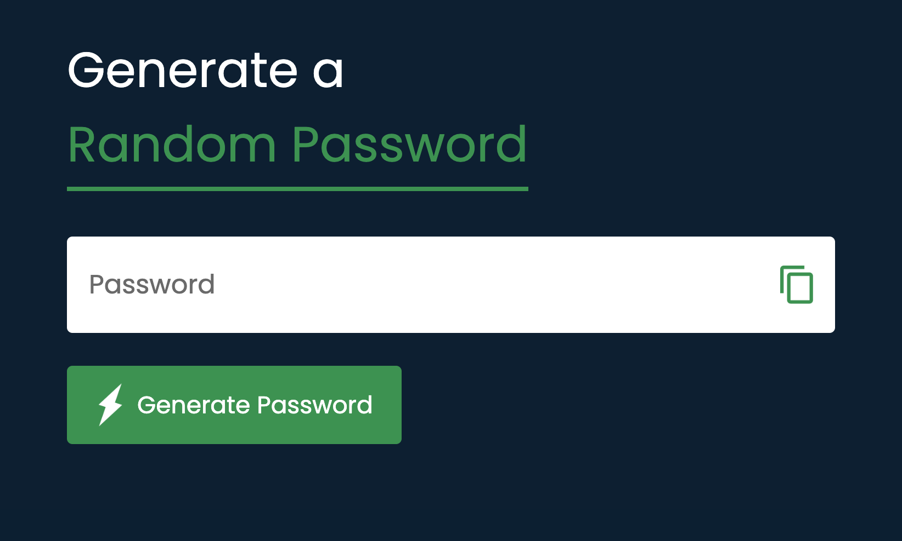
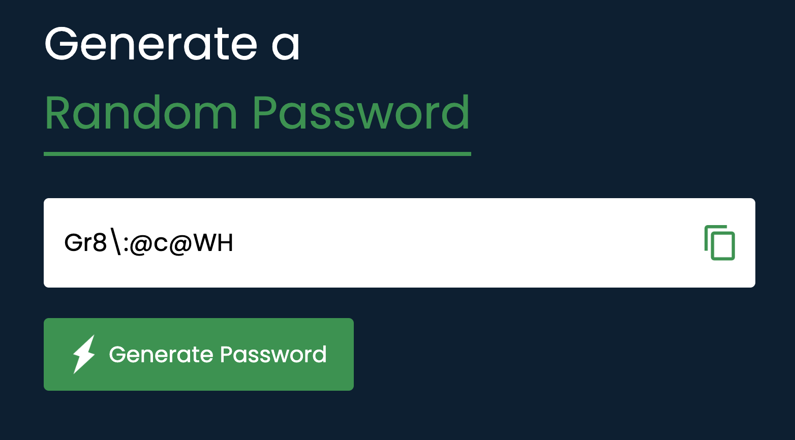

# pass-gen

App: Generate a Random Password

This simple Password Generator app creates a random, secure password using a mix of uppercase and lowercase letters, numbers, and symbols. Users can easily generate a 10-character password with a single click and quickly copy it to their clipboard for use.

Enjoy =^..^=
  
 The app:
 

  The app:
 

Tks Great Stack for the tutorial.